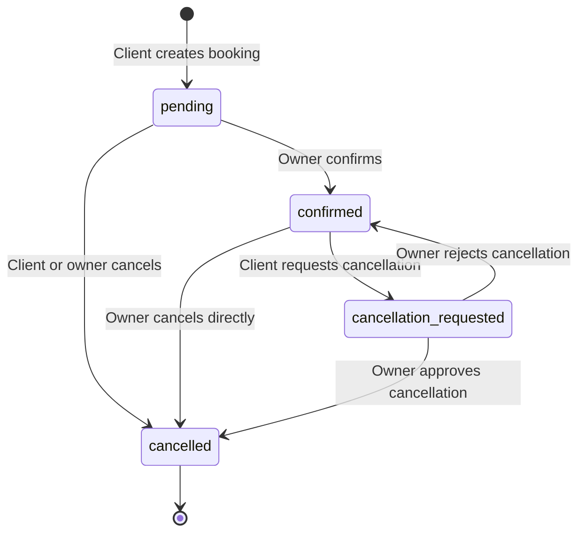

# Technical Mission: Owner-Approved Cancellation for Confirmed Bookings

**Document version:** 1.0  
**Date:** June 18, 2026  
**Project:** Buron — To'yxona (wedding hall) booking platform  
**Scope:** Backend + Owner dashboard (web) + Client app impact (Android / web client)  
**Depends on:** `toyxona-backend`, `toyxona-frontend` (owner dashboard routes)

---

## Table of Contents

1. [Executive Summary](#1-executive-summary)
2. [Problem Statement](#2-problem-statement)
3. [Proposed Business Rules](#3-proposed-business-rules)
4. [Status Model & Lifecycle](#4-status-model--lifecycle)
5. [Backend Changes](#5-backend-changes)
6. [Owner Dashboard Specification](#6-owner-dashboard-specification)
7. [Client App Impact (Android / Web)](#7-client-app-impact-android--web)
8. [Calendar & Availability Rules](#8-calendar--availability-rules)
9. [Notifications (Optional Phase 2)](#9-notifications-optional-phase-2)
10. [Migration & Backward Compatibility](#10-migration--backward-compatibility)
11. [Development Phases](#11-development-phases)
12. [Acceptance Criteria](#12-acceptance-criteria)
13. [QA Scenarios](#13-qa-scenarios)

---

## 1. Executive Summary

Today, a **client can instantly cancel both `pending` and `confirmed` bookings** via `PUT /bookings/:id/cancel`. Once an owner has confirmed a booking, the venue slot is effectively reserved. Allowing instant client cancellation after confirmation creates operational risk (food prep, staffing, lost revenue).

**Goal:** Introduce an **owner-approved cancellation flow** for confirmed bookings:

| Booking status | Client action | Result |
|----------------|---------------|--------|
| `pending` | Cancel | Immediate → `cancelled` (unchanged) |
| `confirmed` | Request cancellation | → `cancellation_requested` (owner must approve) |
| `cancellation_requested` | Wait | Owner approves → `cancelled`, or rejects → `confirmed` |
| `confirmed` | — | Owner may still cancel directly → `cancelled` |

This document defines the **backend API contract**, **owner dashboard UX**, and **required client-side updates** so all platforms stay in sync.

---

## 2. Problem Statement

### 2.1 Current behavior

```
Client submits booking          → status: pending
Owner confirms on dashboard     → status: confirmed
Client taps "Bekor qilish"      → status: cancelled (instant, no owner step)
```

### 2.2 Why this is a problem

- Confirmed bookings represent a **committed reservation** for a specific date and session(s).
- The owner may have already planned staff, catering, or turned away other clients.
- Instant client cancellation after confirmation gives the owner **no control** over release of the slot.

### 2.3 Desired behavior

- **`pending`**: client may still cancel freely (request not yet accepted).
- **`confirmed`**: client may only **request** cancellation; owner **approves or rejects**.
- **`cancellation_requested`**: slot remains blocked until owner decides.
- **Owner** retains the ability to cancel any non-cancelled booking directly.

---

## 3. Proposed Business Rules

### 3.1 Who can do what

| Actor | `pending` | `confirmed` | `cancellation_requested` | `cancelled` |
|-------|-----------|-------------|--------------------------|-------------|
| **Client** | Cancel immediately | Request cancellation | View only; cannot withdraw request* | No action |
| **Owner** | Confirm, reject, cancel | Cancel directly; view cancel requests | Approve cancel, reject cancel | No action |
| **Admin** | Same as owner (optional) | Same as owner | Same as owner | No action |

\* *Optional enhancement: allow client to withdraw a pending cancellation request — see §5.5.*

### 3.2 Authorization

| Action | Rule |
|--------|------|
| Client cancel / request cancel | JWT required; `booking.clientPhone` must match logged-in user's phone |
| Owner confirm / cancel / approve / reject | JWT required; `user.role === "owner"`; booking's venue must belong to that owner |
| Admin override | JWT required; `user.role === "admin"` (optional) |

### 3.3 Error messages (Uzbek)

| Situation | Message |
|-----------|---------|
| Client tries instant cancel on confirmed booking | `Tasdiqlangan bronni bekor qilish uchun egasi ruxsati kerak` |
| Client requests cancel twice | `Bekor qilish so'rovi allaqachon yuborilgan` |
| Owner action on wrong status | `Bu amal ushbu bron holati uchun mumkin emas` |
| Booking already cancelled | `Bron allaqachon bekor qilingan` |

---

## 4. Status Model & Lifecycle

### 4.1 Status enum (extended)

```typescript
type BookingStatus =
  | "pending"
  | "confirmed"
  | "cancellation_requested"   // NEW
  | "cancelled";
```

### 4.2 State diagram



### 4.3 Booking document (new optional fields)

Add audit fields to the `Booking` MongoDB schema:

```typescript
{
  status: BookingStatus,
  cancellationRequestedAt?: Date,      // set when client requests
  cancellationRequestedBy?: "client", // always "client" for now
  cancellationResolvedAt?: Date,       // set when owner approves/rejects
  cancellationResolvedBy?: ObjectId,   // owner user id
  cancellationNote?: string,           // optional client reason (max 500 chars)
}
```

Existing fields (`clientName`, `clientPhone`, `date`, `sessions`, `venue`, etc.) remain unchanged.

---

## 5. Backend Changes

**Repository:** `toyxona-backend`  
**This is the blocking dependency** — owner dashboard and client apps cannot implement the new flow until these endpoints exist.

### 5.1 Modify existing endpoint

#### `PUT /bookings/:id/cancel` (client)

**Current:** Cancels `pending` and `confirmed` bookings.  
**New behavior:**

| Current status | Client call result |
|----------------|-------------------|
| `pending` | → `cancelled` (200, unchanged) |
| `confirmed` | **403** — `Tasdiqlangan bronni bekor qilish uchun egasi ruxsati kerak` |
| `cancellation_requested` | **400** — `Bekor qilish so'rovi allaqachon yuborilgan` |
| `cancelled` | **400** — `Bron allaqachon bekor qilingan` |

**Owner** may continue using owner-scoped cancel (see §5.3) for `confirmed` bookings.

### 5.2 New client endpoint

#### `POST /bookings/:id/cancel-request`

**Auth:** Required (client). Phone must match `booking.clientPhone`.

**Request body (optional):**
```json
{
  "note": "Reja o'zgardi, boshqa kuni bron qilmoqchiman"
}
```

**Validation:**
- `note`: optional string, trim, 0–500 characters

**Behavior:**
- Allowed only when `status === "confirmed"`
- Sets `status` → `cancellation_requested`
- Sets `cancellationRequestedAt`, `cancellationRequestedBy: "client"`
- Clears any previous `cancellationResolvedAt` / `cancellationResolvedBy`

**Success response (200):**
```json
{
  "_id": "...",
  "venue": { "_id": "...", "name": "..." },
  "clientName": "Ali Valiyev",
  "clientPhone": "+998901234567",
  "date": "2026-07-15T00:00:00.000Z",
  "sessions": ["evening"],
  "status": "cancellation_requested",
  "cancellationRequestedAt": "2026-06-18T12:00:00.000Z",
  "cancellationNote": "Reja o'zgardi...",
  "createdAt": "...",
  "updatedAt": "..."
}
```

**Error responses:**

| Status | Message |
|--------|---------|
| 403 | `Bu bronni bekor qilish so'rovini yubora olmaysiz` |
| 400 | `Bekor qilish so'rovi allaqachon yuborilgan` |
| 400 | `Bron allaqachon bekor qilingan` |
| 404 | `Bron topilmadi` |

### 5.3 Owner booking management endpoints

All require `Authorization: Bearer <token>` and `role: owner`. Booking venue must belong to the authenticated owner.

#### `PUT /bookings/:id/confirm` (existing — verify behavior)

- `pending` → `confirmed`
- Return 400 for any other status

#### `PUT /bookings/:id/cancel` (owner scope)

**New rule:** Owner may cancel bookings with status:
- `pending`
- `confirmed`
- `cancellation_requested`

Result: `status` → `cancelled`, set `cancellationResolvedAt`, `cancellationResolvedBy`.

#### `PUT /bookings/:id/approve-cancellation` (NEW)

**Behavior:**
- Allowed only when `status === "cancellation_requested"`
- Sets `status` → `cancelled`
- Sets `cancellationResolvedAt`, `cancellationResolvedBy`

**Success (200):** Updated booking object.

**Errors:**

| Status | Message |
|--------|---------|
| 403 | `Bu amalni bajarish huquqingiz yo'q` |
| 400 | `Bekor qilish so'rovi topilmadi` |
| 404 | `Bron topilmadi` |

#### `PUT /bookings/:id/reject-cancellation` (NEW)

**Behavior:**
- Allowed only when `status === "cancellation_requested"`
- Sets `status` → `confirmed`
- Sets `cancellationResolvedAt`, `cancellationResolvedBy`
- Optionally store `ownerRejectionNote` (internal, not shown to client in v1)

**Success (200):** Updated booking object.

### 5.4 Owner list endpoint (extend existing)

#### `GET /bookings/owner` (or existing owner bookings route)

Ensure response includes:
- All bookings for owner's venues
- Filter query param: `?status=cancellation_requested` for inbox view
- Sort: `cancellationRequestedAt` descending for pending requests

**Suggested response fields for dashboard:**

```json
{
  "bookings": [
    {
      "_id": "...",
      "venue": { "_id": "...", "name": "..." },
      "clientName": "...",
      "clientPhone": "...",
      "date": "...",
      "sessions": ["morning"],
      "status": "cancellation_requested",
      "cancellationRequestedAt": "...",
      "cancellationNote": "..."
    }
  ],
  "counts": {
    "pending": 3,
    "confirmed": 12,
    "cancellation_requested": 2,
    "cancelled": 8
  }
}
```

### 5.5 Optional: withdraw cancellation request (client)

#### `DELETE /bookings/:id/cancel-request`

- Allowed when `status === "cancellation_requested"` and client owns booking
- Reverts to `confirmed`
- Clears `cancellationRequestedAt`, `cancellationNote`

*Defer to Phase 2 if not needed for launch.*

### 5.6 Calendar aggregation update

In `GET /bookings/venue/:venueId/calendar`:

Sessions must remain **blocked** (not in `available`) for bookings with status:
- `pending`
- `confirmed`
- `cancellation_requested`

Only `cancelled` bookings release sessions.

---

## 6. Owner Dashboard Specification

**Repository:** `toyxona-frontend` — owner routes under `/dashboard/*`  
**Web reference pattern:** existing booking confirm/reject UI on owner bookings page.

### 6.1 New UI surfaces

| # | Surface | Purpose |
|---|---------|---------|
| 1 | **Cancellation requests inbox** | List bookings with `status: cancellation_requested` |
| 2 | **Badge / counter** | Show count of pending cancellation requests in nav |
| 3 | **Booking detail actions** | Approve / Reject buttons when status is `cancellation_requested` |
| 4 | **Status badge** | New label for `cancellation_requested` |

### 6.2 Cancellation requests inbox

**Route suggestion:** `/dashboard/bookings/cancellation-requests`  
(or filter tab on existing `/dashboard/bookings`)

**Table columns:**

| Column | Source |
|--------|--------|
| Venue | `booking.venue.name` |
| Client | `booking.clientName` + `booking.clientPhone` |
| Date | formatted `booking.date` (uz-UZ) |
| Sessions | morning / afternoon / evening labels |
| Requested at | `cancellationRequestedAt` |
| Client note | `cancellationNote` (or "—") |
| Actions | Approve, Reject |

**Row actions:**

| Button | API | Confirm dialog |
|--------|-----|----------------|
| **Bekor qilishni tasdiqlash** (Approve) | `PUT /bookings/:id/approve-cancellation` | "Bron bekor qilinsinmi? Vaqt bo'shaydi." |
| **So'rovni rad etish** (Reject) | `PUT /bookings/:id/reject-cancellation` | "Mijoz so'rovi rad etilsinmi? Bron tasdiqlangan holatda qoladi." |

**Empty state:** "Hozircha bekor qilish so'rovlari yo'q"

### 6.3 Existing bookings list updates

On the main owner bookings page:

1. Add status filter option: **Bekor qilish kutilmoqda** (`cancellation_requested`)
2. For `confirmed` bookings: keep **Bekor qilish** (owner direct cancel)
3. For `pending` bookings: keep **Tasdiqlash** / **Bekor qilish**
4. For `cancellation_requested`: show **Tasdiqlash** + **Rad etish** (not generic cancel)
5. For `cancelled`: read-only

### 6.4 Status badge colors

| Status | Label (UZ) | Color |
|--------|------------|-------|
| `pending` | Kutilmoqda | Yellow / amber |
| `confirmed` | Tasdiqlangan | Green |
| `cancellation_requested` | Bekor qilish kutilmoqda | Orange |
| `cancelled` | Bekor qilingan | Red |

### 6.5 Owner dashboard acceptance (owner-only)

- [ ] Owner sees count of pending cancellation requests
- [ ] Owner can list all `cancellation_requested` bookings across their venues
- [ ] Owner can approve → booking becomes `cancelled`, calendar slot freed
- [ ] Owner can reject → booking returns to `confirmed`
- [ ] Owner can still directly cancel `confirmed` bookings without client request
- [ ] Client note displayed when present
- [ ] All actions show loading + error snackbar on failure

---

## 7. Client App Impact (Android / Web)

Once backend is deployed, update **both** the Android app (`bookitAndroid`) and web client (`toyxona-frontend` user routes).

### 7.1 My Bookings screen changes

| Status | Cancel button label | Action |
|--------|---------------------|--------|
| `pending` | **Bekor qilish** | `PUT /bookings/:id/cancel` |
| `confirmed` | **Bekor qilish so'rovini yuborish** | `POST /bookings/:id/cancel-request` |
| `cancellation_requested` | Hidden (or "So'rov yuborilgan" disabled label) | None |
| `cancelled` | Hidden | None |

### 7.2 New status badge

Add to `Constants.STATUS_LABELS`:

```kotlin
"cancellation_requested" to "Bekor qilish kutilmoqda"
```

Color: orange (between pending yellow and cancelled red).

### 7.3 Confirmation dialogs

**Pending cancel (unchanged):**
> "Bronni bekor qilishni tasdiqlaysizmi?"

**Confirmed → request cancel (new):**
> "Tasdiqlangan bronni bekor qilish uchun to'yxona egasining ruxsati kerak. So'rov yuborilsinmi?"

**Optional note field** in dialog (maps to `cancellationNote`).

**After success:**
> "Bekor qilish so'rovi yuborildi. Egasi javobini kuting."

### 7.4 Android files to update

| File | Change |
|------|--------|
| `BuronApiService.kt` | Add `requestCancellation(id, body)` |
| `BookingRepository.kt` | Add `requestCancellation(...)` |
| `MyBookingsViewModel.kt` | Branch cancel logic by status |
| `MyBookingsScreen.kt` | Different button label + dialog per status |
| `Constants.kt` | New status label + badge color |
| `FilterPanel.kt` / `StatusBadge.kt` | Orange badge for new status |
| `strings.xml` | New user-facing strings |

### 7.5 Handle 403 from old cancel on confirmed

If backend is updated before client apps:
- Client calling `PUT /cancel` on confirmed receives 403
- Map message: `Tasdiqlangan bronni bekor qilish uchun egasi ruxsati kerak`
- Prompt user to update app, or offer deep link to request flow once implemented

---

## 8. Calendar & Availability Rules

| Booking status | Blocks session on calendar? |
|----------------|---------------------------|
| `pending` | **Yes** |
| `confirmed` | **Yes** |
| `cancellation_requested` | **Yes** (still reserved until owner decides) |
| `cancelled` | **No** |

**Important:** When owner **approves** cancellation, calendar for that venue/date must immediately reflect freed sessions on next `GET /bookings/venue/:id/calendar` call.

---

## 9. Notifications (Optional Phase 2)

No push notification infrastructure exists today. Future enhancements:

| Event | Recipient | Channel |
|-------|-----------|---------|
| Client requests cancellation | Owner | Email / Telegram / push |
| Owner approves cancellation | Client | SMS / push |
| Owner rejects cancellation | Client | SMS / push |

**Do not block v1 on notifications.**

---

## 10. Migration & Backward Compatibility

### 10.1 Existing data

- No migration needed for existing bookings — they remain `pending`, `confirmed`, or `cancelled`
- New status only applies to bookings created after deploy (or after first cancel-request)

### 10.2 Deployment order

```
1. Deploy backend (new status + endpoints + cancel rule change)
2. Deploy owner dashboard (approve/reject UI)
3. Deploy web client + Android app (request-cancel flow)
```

### 10.3 Rollback plan

If rollback needed:
- Revert backend to allow client instant cancel on confirmed
- Owner approve/reject endpoints can remain unused without breaking old clients

---

## 11. Development Phases

### Phase 1 — Backend (required first)

- Add `cancellation_requested` status to schema and validation
- Add audit fields (`cancellationRequestedAt`, etc.)
- Implement `POST /bookings/:id/cancel-request`
- Implement `PUT /bookings/:id/approve-cancellation`
- Implement `PUT /bookings/:id/reject-cancellation`
- Restrict client `PUT /bookings/:id/cancel` to `pending` only
- Update calendar aggregation
- Unit + integration tests for all transitions

**Estimate:** 1–2 days

### Phase 2 — Owner dashboard

- Cancellation requests inbox / filter tab
- Approve / reject actions with confirm dialogs
- Nav badge count
- Status badge for `cancellation_requested`

**Estimate:** 1–2 days

### Phase 3 — Client apps

- Android My Bookings update (this repo)
- Web client `/my-bookings` parity

**Estimate:** 0.5–1 day per platform

### Phase 4 — Optional enhancements

- Client withdrawal of cancel request
- Client note field in cancel dialog
- Owner rejection note visible to client
- Notifications

---

## 12. Acceptance Criteria

### Backend

- [ ] Client can instant-cancel `pending` bookings
- [ ] Client **cannot** instant-cancel `confirmed` bookings (403)
- [ ] Client can submit cancel request on `confirmed` → `cancellation_requested`
- [ ] Owner can approve cancel request → `cancelled`
- [ ] Owner can reject cancel request → `confirmed`
- [ ] Owner can direct-cancel `confirmed` without client request
- [ ] `cancellation_requested` bookings block calendar sessions
- [ ] `cancelled` bookings free calendar sessions

### Owner dashboard

- [ ] Owner sees pending cancellation requests
- [ ] Owner can approve and reject from list and detail views
- [ ] Status badges and filters include new status

### Android / web client

- [ ] `pending` → instant cancel (unchanged UX)
- [ ] `confirmed` → request cancel (new UX + copy)
- [ ] `cancellation_requested` → no cancel button; status shown clearly
- [ ] Error messages match backend

---

## 13. QA Scenarios

| # | Steps | Expected |
|---|-------|----------|
| 1 | Client books → owner confirms → client taps cancel | Dialog says owner approval needed; status → `cancellation_requested` |
| 2 | Owner approves cancellation request | Status → `cancelled`; session available on calendar |
| 3 | Owner rejects cancellation request | Status → `confirmed`; session still blocked |
| 4 | Client cancels pending booking | Instant `cancelled`; no owner step |
| 5 | Client tries cancel on already `cancellation_requested` | 400 error; UI shows waiting state |
| 6 | Owner direct-cancels confirmed booking | Instant `cancelled` without client request |
| 7 | Guest books with phone X, registers with phone X, requests cancel on confirmed | Works (phone match) |
| 8 | User B tries to cancel User A's booking | 403 |

---

## Appendix A — API Summary

| Method | Path | Actor | Purpose |
|--------|------|-------|---------|
| `PUT` | `/bookings/:id/cancel` | Client | Cancel `pending` only |
| `PUT` | `/bookings/:id/cancel` | Owner | Cancel `pending`, `confirmed`, `cancellation_requested` |
| `POST` | `/bookings/:id/cancel-request` | Client | Request cancel on `confirmed` |
| `PUT` | `/bookings/:id/approve-cancellation` | Owner | Approve client cancel request |
| `PUT` | `/bookings/:id/reject-cancellation` | Owner | Reject client cancel request |
| `PUT` | `/bookings/:id/confirm` | Owner | Confirm `pending` booking |
| `GET` | `/bookings/owner?status=cancellation_requested` | Owner | List cancel requests |

---

## Appendix B — Uzbek UI Strings (reference)

| Key | Uzbek |
|-----|-------|
| `status_cancellation_requested` | Bekor qilish kutilmoqda |
| `booking_request_cancel` | Bekor qilish so'rovini yuborish |
| `booking_request_cancel_confirm` | Tasdiqlangan bronni bekor qilish uchun to'yxona egasining ruxsati kerak. So'rov yuborilsinmi? |
| `booking_request_cancel_success` | Bekor qilish so'rovi yuborildi. Egasi javobini kuting. |
| `booking_request_cancel_note_label` | Sabab (ixtiyoriy) |
| `owner_approve_cancellation` | Bekor qilishni tasdiqlash |
| `owner_reject_cancellation` | So'rovni rad etish |
| `owner_cancellation_inbox_title` | Bekor qilish so'rovlari |
| `owner_cancellation_inbox_empty` | Hozircha bekor qilish so'rovlari yo'q |

---

**End of document**
